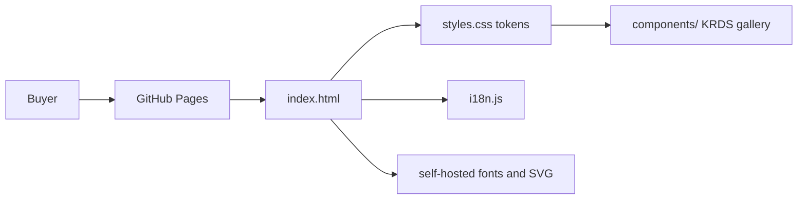

# Architecture

Contextual Wisdom Lab's public homepage is a static GitHub Pages site. There is no build step, package manager, or runtime server. `index.html`, `styles.css`, and `i18n.js` are the product.

## Product boundary

The homepage is a catalog and thesis, not an application. It must:

- name only repositories the organization currently owns
- keep first-party products and forks in separate grids
- send the buyer to a live destination, or show an introduction with no link

Naruon, Orgmetra, TEPP, psychometrics-commons, and contextual-orchestrator are the highest-leverage owned products currently listed beside the existing public tools.

## Design tokens and repeated objects

Brand tokens live in `:root` (`--ink`, `--teal`, `--gold`, `--paper`, `--line`, `--white`). Repeated cards, buttons, and section grids consume those tokens. `components/` is the Storybook inventory for this repository: a vanilla, token-bound KRDS gallery scoped under `.krds-scope`. It is not loaded by the homepage and must not introduce npm, Storybook CLI, or a bundler.

## Internationalization

Korean is the source language. Every translatable node carries `data-i18n`. `setLanguage()` writes `textContent` only. Language resolution is `?lang=` (whitelist `ko` / `en`) → `localStorage["cwl-language"]` → `navigator.language`.

## Accessibility and security

- New-tab warnings live in `.visually-hidden` HTML, not in `aria-label` and not only in CSS `↗`.
- Project-card hit areas use an empty `::after` overlay; the new-tab glyph on those titles uses `::before`.
- CSP is `default-src 'none'` plus explicit self sources and Trusted Types for scripts.
- External links always use `target="_blank" rel="noopener noreferrer"`.

## Operability

Preview with `python3 -m http.server 4173`. Open `/test_i18n.html?lang=ko` and expect `ALL_TESTS_PASSED_SUCCESSFULLY`. Static contracts live in `tests/` and run with `python3 -m unittest`.
