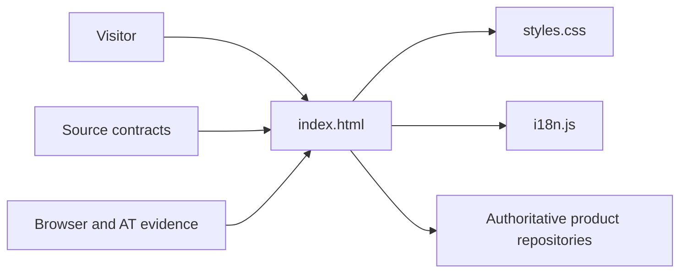
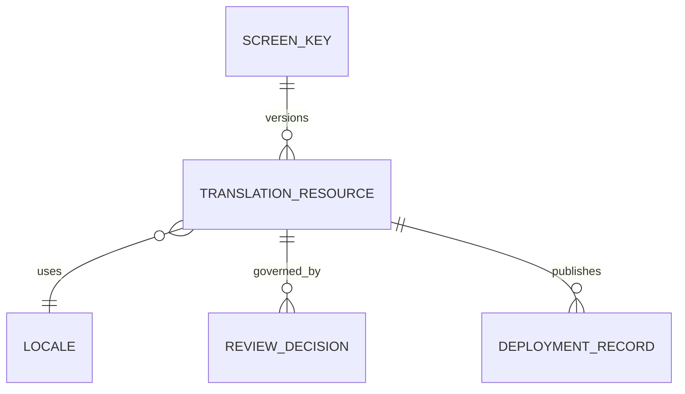

# Product and technical gap baseline

Status: **Proposed**
Canonical writer: [ContextualWisdomLab.github.io#240](https://github.com/ContextualWisdomLab/ContextualWisdomLab.github.io/pull/240)
Evidence ancestor: `818d38088fb22408185a987074161aba9dbb399b` (2026-09-20)
Current exact head and hosted evidence are recorded on the PR after every ordinary-forward update.

This document is the buyer-visible design-assurance ledger for the public
ContextualWisdomLab website. A checked source contract is not a browser,
assistive-technology, deployment, approval, certification, or release claim.

## PRD

### Goal

A visitor can understand ContextualWisdomLab's public purpose and navigate to
the authoritative product repositories without the website replacing product
domain truth.

### Users and scenes

- A prospective buyer scans the homepage by headings and region landmarks.
- A keyboard or screen-reader user skips to main content and navigates sections.
- A multilingual visitor needs equivalent names, wrapping, and next actions.
- An operator must distinguish published website evidence from repository claims.

### Acceptance

The homepage must preserve deterministic content, meaningful landmarks,
keyboard/pointer/touch operation, responsive layout, reduced motion, safe
external navigation, eight locales (ko/en/ja/zh/vi/es/de/fr), and recovery from
offline or missing destinations. Claims require evidence from the same exact
head.

## TRD

The product is a static HTML/CSS/JavaScript site. Semantic HTML and the browser
accessibility tree are the interaction boundary. Python standard-library parsers
provide source contracts; they do not replace Chromium, Firefox, WebKit, or
assistive-technology runs. No new runtime dependency is justified for landmark
validation.

Translation strings currently live in the browser JavaScript object. That is a
presentation resource, not organization or product domain truth. It does not
satisfy the target DB-backed versioned translation authority.

## UML

## ERD

No application database is present in this bounded context, so a product-data
ERD is not applicable. If the shared translation authority is introduced, its
minimum independent model is:

The website must consume a released contract through an API/cache boundary; it
must not copy another owner's source or query its database.

## Context Map

- **Public Narrative (this repository):** homepage composition, public
  navigation, static presentation, Pages deployment evidence.
- **Product repositories (upstream authority):** product behavior, release,
  security, domain language, and operational truth.
- **Translation authority (required shared owner, not yet released):** versioned
  translation, review, approval, deployment, and rollback.
- **GitHub (external):** repository destinations behind ordinary links; the
  website does not infer product readiness from an open PR.

## Exact-head acceptance matrix

| Boundary | Evidence at ancestor | Status | Required action |
| --- | --- | --- | --- |
| Determinism | 11 homepage sections; 11 heading targets | PASS, source only | Keep exact structure contract |
| Semantics | hero uses `aria-labelledby="hero-title"`; parser checks every section and exactly one real heading target | PASS, source only | Replay accessibility tree |
| Keyboard/pointer/touch | No current-head real-browser trace | FAIL | Chromium/Firefox/WebKit interaction run |
| WCAG 2.2 AA / AT | No current-head AT transcript or audit | FAIL | Screen reader and automated/manual audit |
| Responsive | No 320/768/desktop screenshots at current head | FAIL | Capture overflow, wrapping, focus, zoom |
| Reduced motion | Source policy exists; no current-head browser observation | PARTIAL | Verify OS preference in each browser |
| Locales | `i18n.js` exposes ko/en only | FAIL | Released ko/en/ja/zh/vi/es/de/fr screen resources and E2E |
| Loading/empty/error/offline/permission/read-only/stale/conflict/retry/busy | Static surface has no complete evidence set | FAIL | Mark N/A per state with rationale or provide replay |
| CTA to API/destination | Static links exist; no current-head destination replay | FAIL | Validate real destinations and failure guidance |
| Large-data performance | Not applicable to hero landmark; whole-page p95 unmeasured | FAIL (site) | Measure render/interaction p50 and p95 without sample reduction |
| Import/export | No import/export surface | N/A | Reassess if introduced |
| Persistence/reload/rollback | No current-head cache/reload/deploy rollback evidence | FAIL | Exercise reload, offline cache behavior, and deployment rollback |
| Independent approval | Previous approval targets an older head | FAIL | Obtain qualifying current-head approval |
| Hosted Checks | Fresh exact-head generation required after repair | PENDING | Wait without blind rerun |

## Gap and action register

| Gap | Owner | Action | Status |
| --- | --- | --- | --- |
| Literal `\\n-` merged adjacent Unreleased entries | Public Narrative | Reject escaped list separators with `tests/test_changelog.py`; store a real line break | Repaired at `818d38088fb22408185a987074161aba9dbb399b`; hosted evidence pending |
| Existing landmark test skipped anonymous sections | Public Narrative | Validate every section and exactly one heading target | Repaired in #240; hosted evidence pending |
| Palette entry used a stale 2024 date and `h2`-only rule | Public Narrative | Bind guidance to 2026-09-20 evidence and h1-h6 | Repaired in #240 |
| Only ko/en resources exist | Translation authority + Public Narrative consumer | Release eight-locale resource contract, then consume by screen key | Proposed / blocked |
| Browser, AT, responsive, recovery evidence absent | Public Narrative | Produce current-head evidence artifacts | Open |
| Static DTO/catalog may be mistaken for domain truth | Public Narrative | Keep product claims linked to canonical repositories | Open |
| Page performance target is unmeasured | Public Narrative | Measure all pages; repair causal render/runtime bottleneck | Open |
| Exact-head approval and hosted Checks absent | Repository governance | Preserve Draft until independently satisfied | Open |

## External-link indicator acceptance — #268

Product source remains single-writer #268. Predecessor #265 remains Draft with its valid
history preserved, but its automated task branch repeatedly reapplies a stale snapshot.
This documentation lane records evidence only and does not copy mutable homepage source.

- Product evidence exact: `7911416337eab48374637f137a59e91daf43852e`
- RED contract: `50938ba62ab7ec9fdb35bd77c2cd062a9a387b38`
  found 23 new-tab links but only 21 visual indicators; both omissions were
  primary CTA links.
- Production repair: `ef9e2bbe62f6259fed114ae0e5933422bfc4f6f0`
  moves CTA translation keys to visible child spans and adds decorative,
  assistive-technology-hidden indicators.
- Changelog binding and concurrent-regression recovery exact: `7911416337eab48374637f137a59e91daf43852e`.
  #268 starts from #265 head `b42b1ced7014598a9b552ff4ef187d2be3f183ce`,
  preserving its full branch history, then restores the three repeatedly deleted
  verified blobs ordinary-forward without force or destructive rebase.

| Acceptance dimension | Exact evidence | Status |
| --- | --- | --- |
| Determinism | 23 `target="_blank"` links / 23 visual indicators | Source GREEN |
| Locale persistence | translated CTA text is a child span; indicator is a sibling | Source GREEN |
| Semantics | `aria-describedby` new-window description and hidden decoration remain separate | Source GREEN |
| Real browser / AT | Chromium, Firefox, WebKit and assistive-technology replay absent | FAIL |
| Responsive / touch | 320px, 768px, desktop and touch evidence absent | FAIL |
| Eight locales | ko/en/ja/zh/vi/es/de/fr screenshots and overflow checks absent | FAIL |
| Performance | deployed page median/p95 and layout-shift evidence absent | FAIL |
| Review / hosted gates | current exact-head independent approval and terminal required Checks absent | Pending |

Keep #268 and predecessor #265 Draft / Proposed. #268 is the canonical writer;
no publication, merge, or release claim is authorized from source-level evidence alone.

## Standards and evidence

- World Wide Web Consortium. (2023). *Web Content Accessibility Guidelines
  (WCAG) 2.2*. https://www.w3.org/TR/WCAG22/
- Web Hypertext Application Technology Working Group. (2026). *HTML Living
  Standard: The section element*. https://html.spec.whatwg.org/multipage/sections.html#the-section-element
- World Wide Web Consortium. (2026). *Accessible Rich Internet Applications
  (WAI-ARIA) 1.2: region role*. https://www.w3.org/TR/wai-aria-1.2/#region

These standards explain the semantic boundary. Repository source, tests,
current-head workflow logs, browser artifacts, and review records remain the
acceptance evidence.

## Gallery mutation-guard acceptance — #267

Product source remains single-writer #267; this ledger records evidence only.
Product evidence exact: `0c6ddb71faf6eabe24c3c1bfd3c055ea97fa1f25`.

PRD: APG tab selection, focus, and panel visibility must remain deterministic.
TRD: conditional DOM writes are a Proposed implementation detail and cannot
become the semantic contract. Context Map and UML remain the existing
Gallery → Tab Group → Panel presentation flow. ERD impact is none.

| Concern | Evidence | Status |
| --- | --- | --- |
| Tab semantics | Existing Node harness covers wrapped Arrow/Home/End transitions and atomic failure | Source PASS |
| Mutation reduction | No exact-head read/write-count contract | FAIL |
| Browser performance | Chromium/Firefox/WebKit scripting/style/layout/paint median and p95 absent | FAIL |
| Responsive / input | Pointer, touch, keyboard and 320/768/desktop replay absent | FAIL |
| Locales | ko/en/ja/zh/vi/es/de/fr overflow and fallback evidence absent | FAIL |
| Recovery | Reload and stale/conflict behavior are not affected or evidenced | Pending |
| Review / hosted gates | Current approval and terminal required Checks absent | Pending |

Action: keep #267 Draft / Proposed, add an exact mutation-count harness, then
profile identical browser interactions with stated warm-up, sample size, and
failure denominator. Source inspection alone must not publish a
layout-thrashing or paint-improvement claim.

